# MusiCat


ChatGPT와인공지능 음성기술을 결함한 인공지능 라디오 DJ 

프로젝트 URL : [AI DJ Musicat](https://musicat.kr)

프로젝트 UCC : [Musicat - UCC](https://ramen-buang.notion.site/Musicat-UCC-c561acbeb18743fb94ad90b9eeb6be23)

프로젝트 기간: 2023.02.27 ~ 2023.04.07

## 프로젝트 소개 (배경, 개요)
 많은 기업에서 ChatGPT를 활용한 다양한 서비스를 출시하고 있습니다. 이런 흐름에 발맞춰 인공지능 음성도메인과 결합하여 인공지능 DJ 라디오 방송인 뮤직캣을 기획하게 되었습니다.

 지치지 않는 AI DJ 뮤직캣은 청취자에게 연중 무휴 24시간 중단 없는 서비스를 경험을 제공합니다. 또한 라디오 진행에 필요한 수많은 자원을 대신하여 프로그램 관리만을 통해 방송컨텐츠를 제공할 수 있습니다.

## 프로젝트 기능 소개
- 기능1
- 기능2
- 기능3
- 기능4

## 사용 기술
* 이슈 관리 : Jira
* 형상 관리 : Git, Gitlab
* 의사소통, 협업: Notion, Mattermost, Discord
* 개발환경
    * OS : Window10
    * IDE : Intellij, VSCode
    * EC2 : Ubuntu 20.04 LTS (GNU/Linux 5.4.0-1018-aws x86_64)
    * Database : Mariadb 10.6
    * SSH : Windows Terminal, MobaXterm
    * CI/CD : Jenkins
    * Reverse Proxy : Nginx
    * SSL : CertBot, Let's Encrypt
* 프론트엔드 (React)
    * Typescript
    * React
    * Recoil
    * React-Query
    * Vite
    * sockjs-Client
    * stompjs
    * threejs
* 백엔드 (SpringBoot)
    * Springboot Starter Data JPA
    * Springboot Starter Websocket
    * Springboot Starter Security
    * JWT
    * Spring kafka
    * google api services youtube v3 (youtube data api v3)
    * google http client gson
    * jsoup
    * lombok
    * spring boot devtools
    * mariadb java client
* 백엔드 (RadioServer)
    * FastAPI
    * asyncio
    * pydub
    * mariadb
    * kafka
    * gunicorn
    * uvicorn

## 프로젝트 파일 구조
### 백엔드
```bash
.
├── gradle
│   └── wrapper
└── src
    ├── main
    │   ├── java
    │   │   └── com
    │   │       └── musicat
    │   │           ├── Oauth
    │   │           ├── auth
    │   │           ├── config
    │   │           ├── controller
    │   │           │   ├── item
    │   │           │   ├── notice
    │   │           │   ├── radio
    │   │           │   └── user
    │   │           ├── data
    │   │           │   ├── dto
    │   │           │   │   ├── alert
    │   │           │   │   │   ├── request
    │   │           │   │   │   └── response
    │   │           │   │   ├── chat
    │   │           │   │   ├── item
    │   │           │   │   ├── music
    │   │           │   │   ├── notice
    │   │           │   │   ├── radio
    │   │           │   │   ├── socket
    │   │           │   │   ├── spotify
    │   │           │   │   ├── story
    │   │           │   │   └── user
    │   │           │   ├── entity
    │   │           │   │   ├── item
    │   │           │   │   ├── notice
    │   │           │   │   ├── radio
    │   │           │   │   └── user
    │   │           │   └── repository
    │   │           │       ├── item
    │   │           │       ├── notice
    │   │           │       ├── radio
    │   │           │       └── user
    │   │           ├── handler
    │   │           ├── interceptor
    │   │           ├── jwt
    │   │           ├── service
    │   │           │   ├── chat
    │   │           │   ├── item
    │   │           │   ├── kafka
    │   │           │   ├── notice
    │   │           │   ├── radio
    │   │           │   ├── socket
    │   │           │   └── user
    │   │           └── util
    │   │               └── builder
    │   └── resources
    │       └── static
    └── test
        └── java
            └── com
                └── musicat
```

### 프론트엔드
```bash
.
├── public
│   ├── graphic
│   │   ├── animation
│   │   ├── background
│   │   │   ├── 1
│   │   │   └── 2
│   │   └── cat
│   └── img
│       ├── background
│       ├── badge
│       ├── cd
│       ├── pagebackground
│       ├── tape
│       └── theme
└── src
    ├── asset
    │   ├── font
    │   └── img
    ├── atoms
    ├── components
    │   ├── broadcast
    │   │   ├── graphicCanvas
    │   │   │   └── background
    │   │   └── radioPlayer
    │   ├── common
    │   │   ├── board
    │   │   ├── button
    │   │   ├── input
    │   │   ├── modal
    │   │   ├── pagenation
    │   │   ├── selectBox
    │   │   └── songSearch
    │   ├── header
    │   │   ├── onairSign
    │   │   └── popover
    │   └── sideNav
    │       ├── mypageNav
    │       └── tapeNav
    │           ├── CDplayer
    │           ├── Tape
    │           ├── tapeButtons
    │           └── volumeBar
    ├── connect
    │   ├── axios
    │   │   └── queryHooks
    │   └── socket
    ├── customHooks
    ├── pages
    │   ├── common
    │   │   ├── loadingSpinner
    │   │   ├── loginSuccess
    │   │   └── page404
    │   ├── home
    │   │   ├── about
    │   │   ├── chat
    │   │   ├── songRequest
    │   │   │   └── songList
    │   │   │       └── songDetailModal
    │   │   └── story
    │   │       ├── contentBox
    │   │       └── contentPlus
    │   └── mypage
    │       ├── inventory
    │       │   └── inventoryModal
    │       ├── myinfo
    │       │   └── myinfoModal
    │       ├── notice
    │       ├── noticeDetail
    │       ├── noticeManage
    │       ├── noticeManageModify
    │       └── userManage
    │           └── SelectedUsers
    └── types
```
### 라디오 서버
```bash
.
├── api_chatgpt.py
├── api_naver_tts.py
├── database.py
├── kafka_handler.py
├── logic_chat.py
├── logic_empty.py
├── logic_music.py
├── logic_opening.py
├── logic_story.py
├── main.py
├── my_logger.py
├── my_util.py
├── radio_progress.py
├── shared_env.py
├── shared_state.py
└── tts
    └── mymusic
```

## 역할 분배
| 이름 | 사진 | 역할 | 정보 |
| ---- | ---- | ---- | ---- |
| 김동언 |  | 백엔드 | 카프카 / FastApi / CI/CD |
| 이찬희 |  | 백엔드 | SpringBoot |
| 최웅렬 |  | 백엔드 | SpringBoot / Oath / Security |
| 이연학 |  | 프론트엔드 | React |
| 박동환 |  | 프론트엔드 | React |
| 최다은 |  | 프론트엔드 | React |

## 프로젝트 산출물

### 기능 기획서
  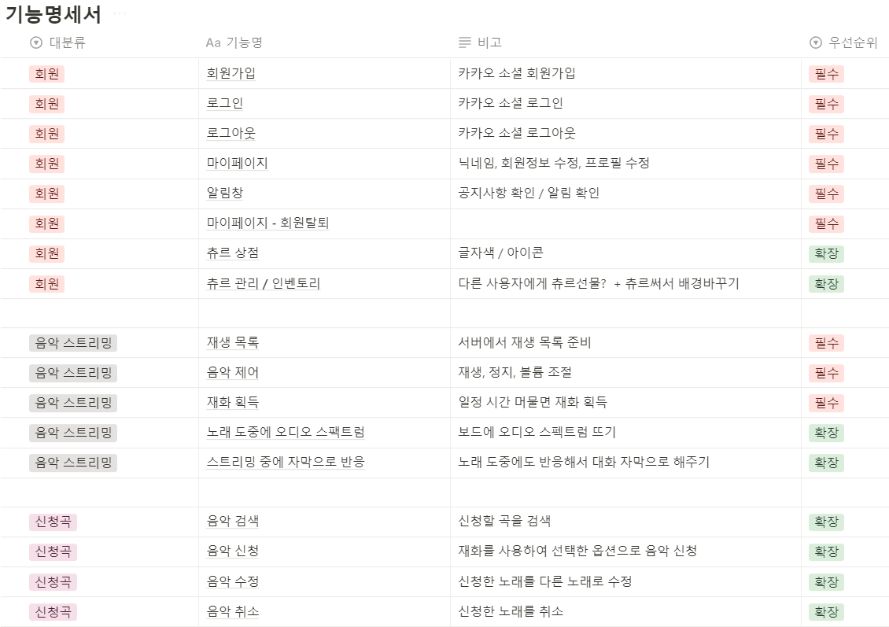
  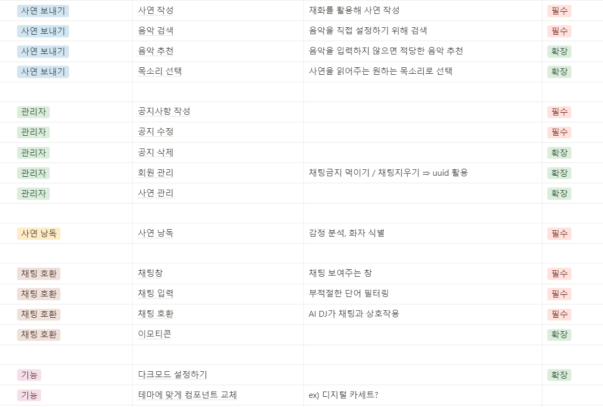

  ---

### 시스템 아키택쳐
  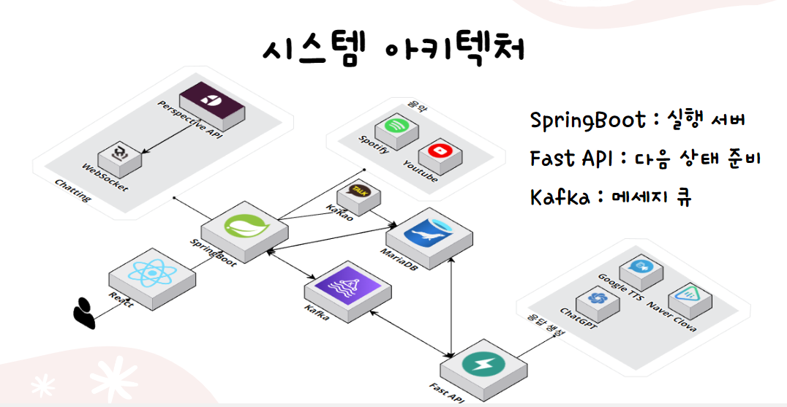

  ---

### API 명세서
  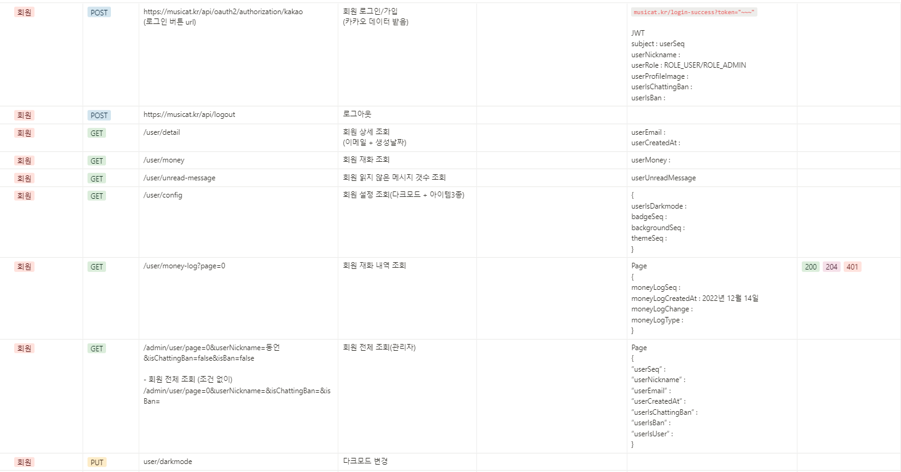
  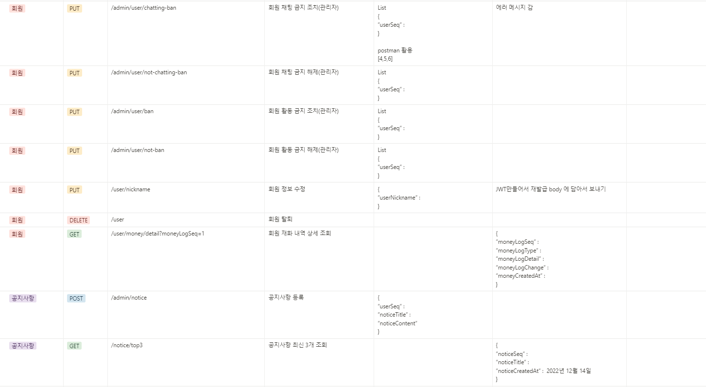
  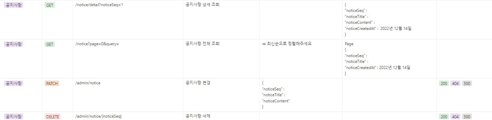
  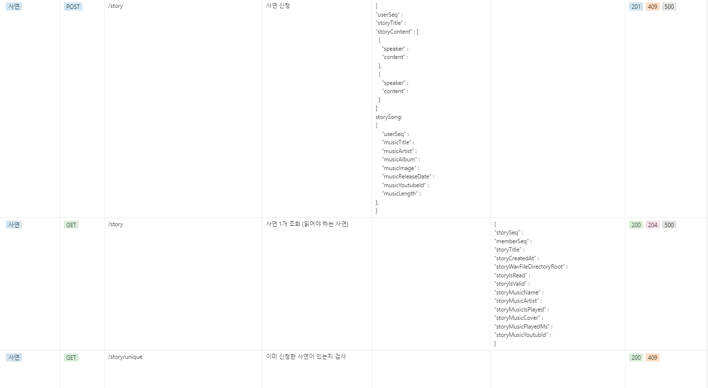
  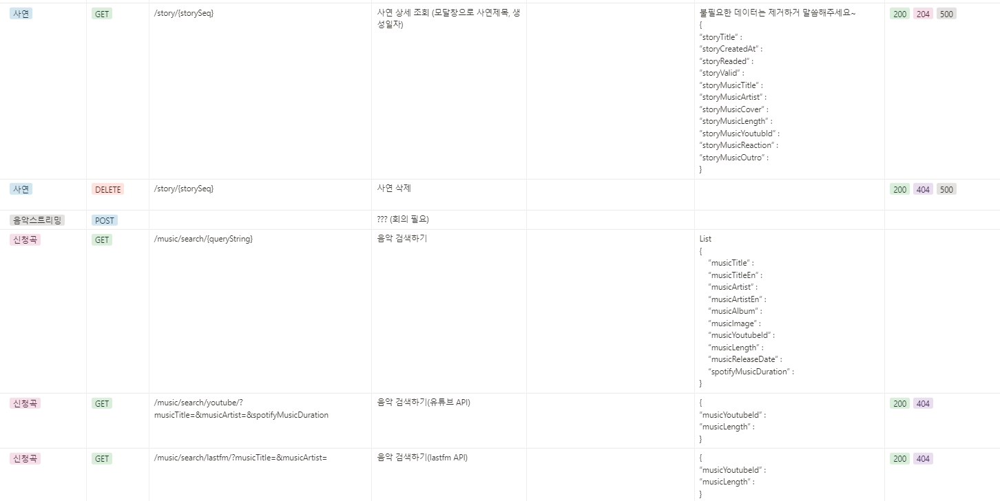
  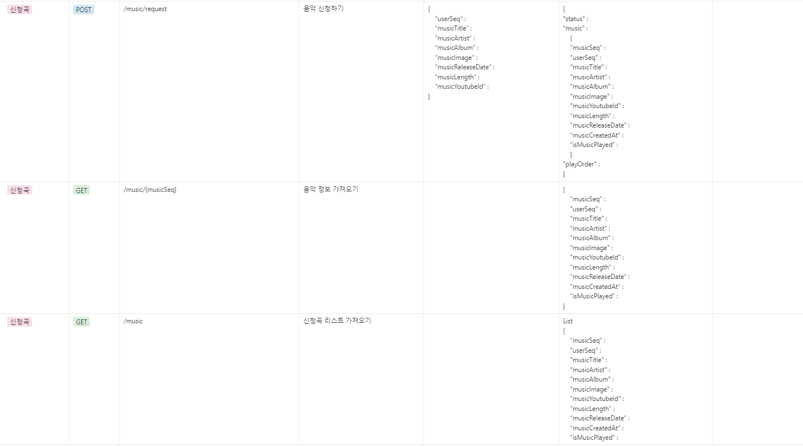
  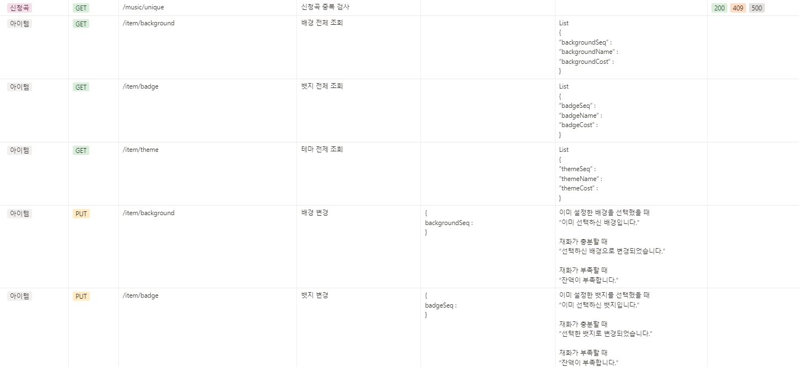
  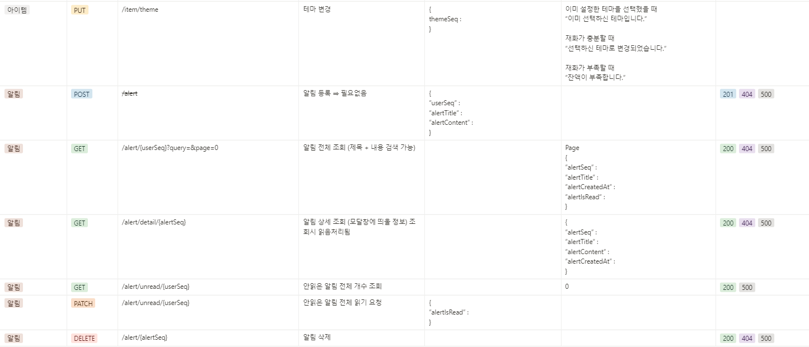

  ---

### ERD 다이어그램
  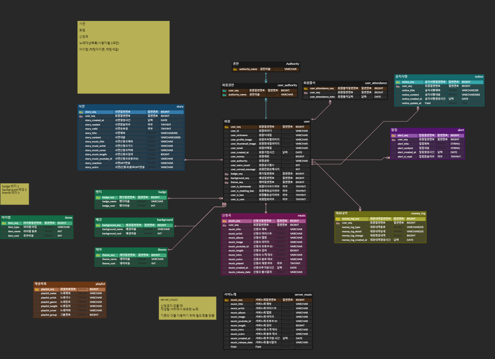

  ---

### MockUp & Design
  
  
  

  ---

## 서비스 동작 이미지와 설명


- 설명1
- 설명2
- 설명

## 프로젝트 참고 링크

- [프로젝트 Notino](https://ramen-buang.notion.site/SSAFY-2-MusiCat-6ce1496529df4689bdae266db3d50466) Musicat
- [GitHub - Link](자기 githut 링크) 포트폴리오 Github Link


